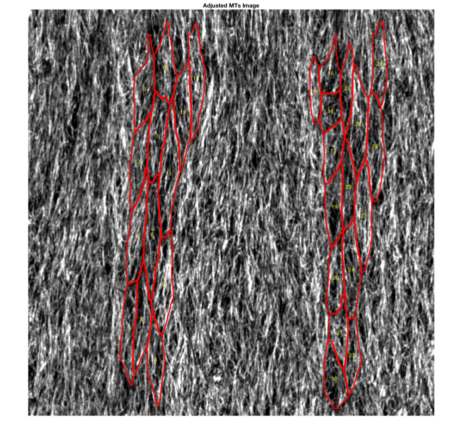

# MTSD

This is a script to analyse cytoskeleton organisation in 2D images

## Input data

The following three sub-folders within a single directory need to be present:
1. **borders** with the 8-bit tif images of cell outlines (e.g. E-cadherin staining) segmented in Packing Analyser. Each image will have a subfolder with the same name, that need to contain "tracked_bd.png" mask.

1. **cytoskeleton** with the corresponding tif projections (we use maximum projection in this case), which will be analysed for alignment of cytoskeleton fibres within cells.

Images should be numbered, but the numbers do not have to be sequential, and the names might contain additional information. The numbers in image names will be used in the output files.

## Running the script

### From MATLAB

1. Start **actin_automatic_v1.m** script.

1. Select a folder with input data.

### As a standalone application (*contact me for installation files and instructions*)

1. Download MTSD application and install following the instructions.

1. Open the application.

1. Select the folder with input data.

## Output files and format

The following folders will be automatically created depending on the selection at the start of a run.
1. **distribution** with cell-by-cell signal direction distributions for each image (**image number**_distribution.csv).

1. **images_analysed** with adjusted images of cytoskeleton, projection of a cell mask on them and numbers of each analysed cell. 

1. **summary** with the summaryzed data.

In the summary folder the subfolder *MTSD* will be created. These subfolder will contain **image number**_summary_**run choice**_MTSD.csv files with cell-by-cell data for each analysed image. The cell numbers correspond to that in *images_analysed* files.

Additionally, the summary folder itself will contain the file *Summary.csv* with data averaged per image. When avarages are calculated, cells that are outliers based on their area, eccentricity or MTSD value are automatically identified and excluded.

## Output data explained

The following columns record cell-by-cell data:
1. **Cell** - cell number, which correspond to the cell number in *images_analysed*.
1. **Area** - area in pixels of each cell.
1. **Eccentricity** - eccentricity of each cell.
1. **Direction_cell** - direction of the main axis of each cell calculated from regionprops.
1. **SD** - a measure of cytoskeleton alignment, which is a standard deviation of signal direction distribution, fitted with Von-Misus distribution. For detailed explanation of how it is calculated see Gomez J.M., Chumakova L., Bulgakova N.A., Brown N.H. (2016) Microtubule organization is determined by the shape of epithelial cells. Nature Communications, 7. [PubMed](https://www.ncbi.nlm.nih.gov/pubmed/27779189).
1. **DEV** - a measure of direction of overall cytoskeleton orientation - mean of signal direction distribution, fitted with Von-Misus distribution.
1. **Elongation** - aspect ratio of each cell calculated from eccentricity.
1. **Alignment** - an alernative measure for cytoskeleton alignment, calculated as proportion of signal within 10° of mean signal direction.

In the *Summary.csv* columns with standard errors of the mean (sem) will be additionally included after each corresponding column with averaged values. The first column will contain the sample/image number, and the last column will contain the number of identified and excluded outliers. 

## References
1. Gomez J.M., Chumakova L., Bulgakova N.A., Brown N.H. (2016) Microtubule organization is determined by the shape of epithelial cells. Nature Communications, 7. [PubMed](https://www.ncbi.nlm.nih.gov/pubmed/27779189).
1. Lin A.C., Bygrave A.M., de Calignon A., Lee T., Miesenböck G. (2014). Sparse, decorrelated odor coding in the mushroom body enhances learned odor discrimination. Nat Neurosci. 17(4):559-68. [PubMed](https://www.ncbi.nlm.nih.gov/pubmed/24561998).

## Algorithm

1. *Quantification of cell parameters and generation of cell masks.*
⋅⋅1. Images with α-tubulin signal and masks of cell borders are loaded.
⋅⋅1. Individual objects/cells are identified by tracing boundaries in the images with masks of cell borders. Objects touching image borders are removed.
⋅⋅1. Parameters of identified objects/cells are obtained and stored: eccentricity, lengths of major and minor axes, orientation and area.
⋅⋅1. Masks of each identified cell/object are generated based on boundaries.

1. *Generation of a histogram of signal change magnitudes with respect to direction.*
⋅⋅1. Images with α-tubulin signal are converted to double precision.
⋅⋅1. Using the generated cell masks, α-tubulin signal is filtered for each cell from the α-tubulin image by multiplication of the mask and the image.
⋅⋅1. The filtered α-tubulin signal is 2D-convolved using a modified 5x5 Sobel filter. 
⋅⋅1. Directions (angles in radians) and magnitudes of signal change (from now on “magnitudes”) are calculated for each pixel from convolution. Directions are converted to degrees from radians.
⋅⋅1. Pixels whose magnitudes were smaller than 22% of maximum magnitude are excluded to reduce noise for the estimation of microtubule alignment.
⋅⋅1. Pixels are sorted according to their direction of signal change to generate a histogram of magnitude of signal change with respect to its direction for each cell/object, bin data every 4º, sum magnitudes of pixels that fall within the same bin, and normalize the resulting histogram to total intensity.

1 *Estimation of microtubule alignment parameters: MTSD and MTDEV.*
⋅⋅1. Individual histograms are fitted with Von Mises distribution8. As histograms of magnitudes range from -90° to 90° degrees, and the circular statistics is performed on -180° to 180° range, stretch the histograms linearly by factor of 2.
⋅⋅1. Concentration parameter (kappa) and mean (mu) of Von Mises distribution are calculated for each histogram. kappa is used to estimate the standard deviation of distributions, whereas mu is used to estimate the main direction of change (phi). To compensate for previously applied stretch, divide both values by 2.
⋅⋅1. MTSD is quantified as the standard deviation around the mean direction of α-tubulin signal, thereby informing about microtubule alignment with each other: SD = sqrt(1/kappa). 
⋅⋅1. MTDEV (for MicroTubule direction DEViation) is quantified as the difference between the direction of cell's long axis (cell_dir) and the mean direction of α-tubulin signal. To estimate the main direction of α-tubulin signal (x), apply a 90º correction to main direction of change (phi) given that the signal changes perpendicular to its main direction. Calculate the absolute difference between the main direction of α-tubulin signal (x) and the cell's long axis: MTDEV = abs(cell_dir - x). 
⋅⋅1. Cell shape parameters (5.1.3) and microtubule alignment parameters (MTSD, MTDEV) are saved for each cell in each image, and as averaged data per image.
